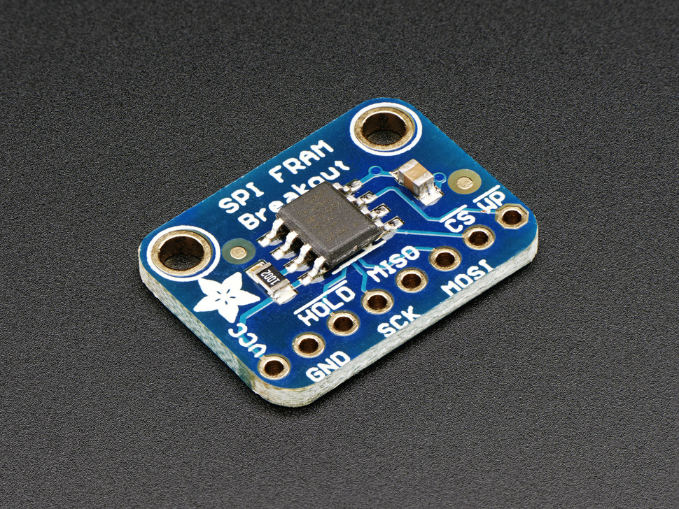
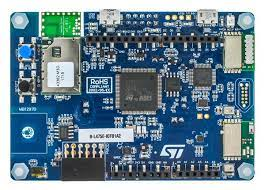
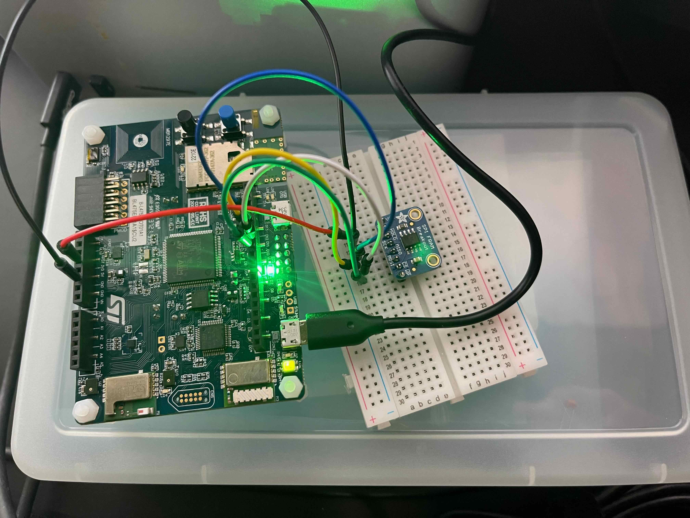

# micropython-spi

# Using Micropython on a B-L476E-IOT01A development board

### TL;DR It didn't work for this project, but I was very impressed with how much faster it was to iterate on writing Python code on your local computer and using `mpremote` to mount and execute the code on the microcontroller.  Here's a pretty good [video](https://www.youtube.com/watch?v=EVJA01W9ArI&t=373s) of showing `mpremote` in action.


## The goal of the project was to use SPI to communicate to an Adafruit FRAM [board](https://www.adafruit.com/product/1897) during the [UCSD Embedded Systems Hardware Design](https://extendedstudies.ucsd.edu/courses-and-programs/embedded-systems-hardware-design) class

# The Hardware



connected to an STM32L4 Discovery Kit



# Development 

## Steps using MacOS Ventura on an M1 Mac
First, install homebrew and tools
  ```
  brew install git git-lfs python3 gettext uncrustify cmake
  brew link gettext --force
  brew install --cask gcc-arm-embedded
  brew install dfu-util
  brew install stlink
  ```
Next, install micropython, micropython-lib and mpremote
```
  git clone git@github.com:micropython/micropython.git
  git clone git@github.com:micropython/micropython-lib.git
  cd micropython
  make -C mpy-cross
  pip3 install mpremote (use a venv)
  mpremote
  mpremote ls
```
Finally, build and deploy micropython to the Discovery board over the USB connection



```
  cd ports/stm32
  make BOARD=B_L475E_IOT01A submodules
  make BOARD=B_L475E_IOT01A
  make BOARD=B_L475E_IOT01A deploy-stlink
```

Here's an example of running `mpremote` (aliased to `mp`) to mount your computer local filesystem to the board.

```
(venv) ➜  stm32 git:(master) mp mount .
Local directory . is mounted at /remote
Connected to MicroPython at /dev/cu.usbmodem83303
Use Ctrl-] or Ctrl-x to exit this shell
>
MicroPython v1.20.0-431-g6aa404ca5 on 2023-09-01; B-L475E-IOT01A with STM32L475
Type "help()" for more information.
>>>
```

At this point you have a Micropython REPL running on the Discovery board.  Here's the neat part, you can now do local file editing using your tools of choice, and quickly test your changes.  I found this to be _much_ faster than compiling and deploying using the Arduino IDE.

In the below example, I'm developing my Python code in a file called `l.py` on my Mac using vim.  After I save my changes, I then switch tmux panes where I have an `mpremote` session already running.  

```
MicroPython v1.20.0-431-g6aa404ca5 on 2023-09-01; B-L475E-IOT01A with STM32L475
Type "help()" for more information.
>>>
Remount local directory ./ at /remote
>>> import l
Press W to write data, R - to read
w
Enter a hex byte (from 0x00 to 0xFF)
0x00
```

Unfortunately, I wasn't able to the the SPI code to work and switched from Micropython to Arduino to finish the project.

I likely would have had a lot more success using a board that was fully supported by CircuitPython (vs MicroPython).